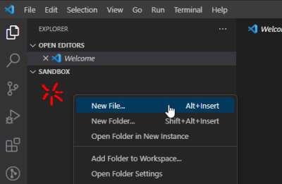
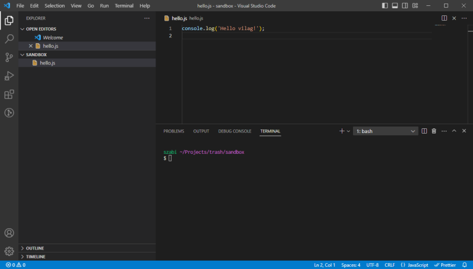
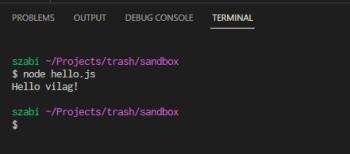
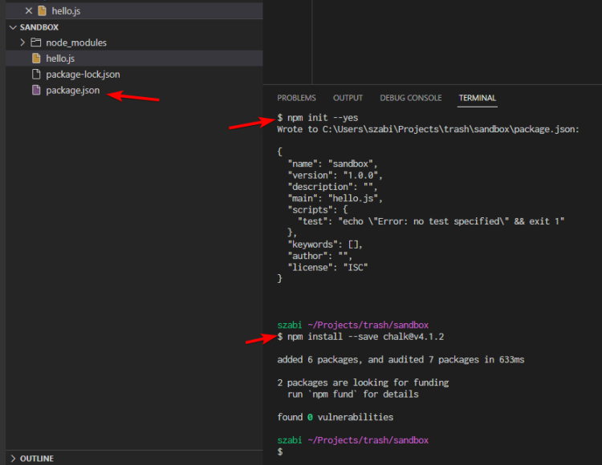
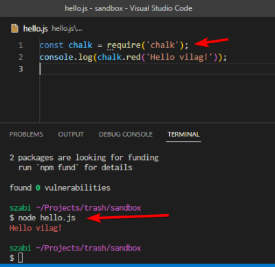

# node

Kezdjuk a **node**-dal.

Csinaljunk egy mappat (foldert, directoryt) a home konyvtarunkban `Projects` neven,
ebbe csinaljunk egy `sandbox` nevut. Jobb klikk ezen a mappan es `Open with vscode`.

Vscode-ban a bal savban a projekt neve alatt van a filemenedzser. Jobb klikk es
`New File...`, legyen ez egy `hello.js`.



Ide lehet javascript nyelven programot irni.

Irjuk bele az alabbit: `console.log('Hello vilag!');`, enter es save.

Vscode-ban van egy egyszeru, beepitett terminal, ami nagyon kenyelmes. Nyissuk ki
a `ctrl+backtick` (dolt egyes aposztrof, angol billentyuzeten bal felul, az 1-es mellett),
vagy a `Terminal` menubol fent (`New Terminal`).

Valami hasonlot kell latnunk:



A terminalban a `tab` gomb a kodkiegeszites. Pl. kezdjuk el gepelni, hogy `node he` + `tab` es
kiegeszul arra, hogy `node hello.js`. Ezzel a paranccsal, a node le fogja futtatni az elobb
megirt js fajlunkat:



Kesz is az elso javascript programunk!

## npm

A node-nak van egy csomagkezeloje, az `npm`, amivel masok altal keszitett kodokat
be tudunk huzni a sajat projektbe.

Peldaul irjuk ki az elobbi uzenetet <strong style="color:red">pirossal</strong>.

Ahhoz, hogy az npm mukodni tudjon, ezt a konyvtarat projekt-konyvtarra kell alakitani
(inicializalni kell). Terminalban: `npm init --yes`. Ez letrehoz nekunk egy `package.json`
file-t, ide kerulnek a projektre jellemzo adatok, peldaul futtato parancsok, telepitett
csomagok nevei, a projekt leirasa stb.

Telepitsuk a `chalk` nevu projekt 4-es verziojat (az ujabb nekunk nem jo most):
`npm install --save chalk@v4.1.2`



Ezek utan hasznalhatjuk a chalk-ot a sajat programunkban!

Irjuk at a fenti programot az allabbiak szerint:

```js
const chalk = require('chalk');
console.log(chalk.red('Hello vilag!'));
```

Ha ezutan lefuttatjuk a `node hello.js` paranccsal, akkor remelhetoleg piros lett a feliratunk:



Orom, boldogsag!
