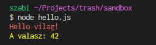

# json

A `.json` fajlok adatokat tartalmaznak olyan formatumban, amit a js "megert".

Vscode-ban ha a projekt hasznalja a prettier extensiont, akkor a formazas ki tudja javitani
az egyszerubb hibakat is.

Csinaljunk egy uj file-t a korabbi `sandbox` projektbe: `adatok.json`.

Irjuk bele:

```json
{ "valasz": 42 }
```

Formazzuk meg:
`ctrl+shift+p`-vel nyissuk meg a vscode parancskeresot.

Kezdjuk el gepelni: `Format Document` es valasszuk is ki.
Latjuk, hogy most mar bekerultek space-ek.

Menjunk vissza a `hello.js`-hez es hasznaljuk ezt az adat file-t:

```js
const chalk = require('chalk');
const adatok = require('./adatok.json');
console.log(chalk.red('Hello vilag!'));
console.log(chalk.yellow('A valasz: ' + adatok.valasz));
```

Ha most lefuttatjuk a kodot, ezt fogjuk latni:



## mik lehetnek a jsonban?

Javascript ertekek. Tehat: szamok, stringek (szoveg), igaz/hamis (boolean), tombok es objektumok.
Itt egy pelda:

```json
{
  "valasz": 42,
  "kedvenceSzin": "barna",
  "sikeresHidAtkeles": true,
  "toketlenFecskeSebessege": 38.2,
  "fecskekTipusai": ["Füsti", "Odú", "Karolinai", "Tökös", "Töknélküli"],
  "jovoHetiLottoNyeroszamok": [13, 29, 75, 6, 30],
  "kozbeszerzesNyertesek": [
    { "nev": "Meszaros es Meszaros Kft.", "kenoPenzSzazalekban": 25 },
    { "nev": "Tiborc Elektronika Zrt.", "kenoPenzSzazalekban": 58 },
    { "nev": "Szajer Jozsef badogos", "kenoPenzSzazalekban": 10 }
  ]
}
```
