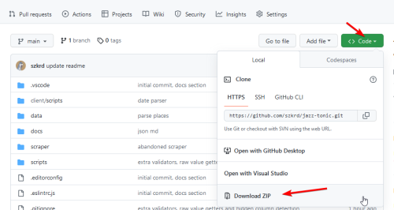

# git

A git egy verziokezelo, olyasmin mint regen az _svn_, vagy a _cvs_ volt.
A git bonyolult, de rendszerint csak kis reszet hasznaljuk.
Eredetileg a linux operacios rendszer kernel forrasanak kezelesehez keszult.

A git a legtobb uj mac-en alapbol ott van (meg kell nyitni egy terminalt es `git --version`),
de Windowsra [le kell tolteni](https://git-scm.com/download/win).

## github

A [github](https://github.com) egy platform, amit a git toolon (es a bongeszon)
keresztul lehet elerni es ahol a szoftverek forraskodjat lehet tarolni.

Ennek a projektnek itt van a forraskodja: https://github.com/szkrd/jazz-tonic

Ott a "code" gombot lenyitva le lehet tolteni az egeszet zipben:

A kicsomagolt zip egyszeru, de a modositasokat nem lehet igy felkuldeni a github oldalara.

Ahhoz, hogy a valtoztatasok, modositasok felkeruljenek az online tarolt valtozatba (a "repo"-ba),
hasznalni kell a `git` parancsot a terminalban. Ehhez
[szamos tutorial letezik](https://www.startpage.com/do/dsearch?query=basic+git+tutorial+for+dummies).

## git terminalbol

### csak olvashato

1. huzzuk le a projektet: `git clone https://github.com/szkrd/jazz-tonic.git`
   (ez megcsinalja a projekt konyvtarat is)
2. az uj mappan nyissuk meg a vscode-ot
3. a legfrissebb valtozat lehuzasa (vscode vagy kulso terminalbol): `git pull`
4. lokalis valtoztatasok torlese (uj fileokat nem torli ki): `git reset --hard`

### olvashato es irhato (felkuldheto)

Lasd: [github tutorial](https://docs.github.com/en/get-started/quickstart/hello-world)

1. legyen az [ssh kulcs beallitva](https://docs.github.com/en/authentication/connecting-to-github-with-ssh/generating-a-new-ssh-key-and-adding-it-to-the-ssh-agent)
2. regi repo torol, ssh-n keresztul lehuz (windowson maradhat a https): `git clone git@github.com:szkrd/jazz-tonic.git`
3. `cd jazz-tonic` = belep a konyvtarba
4. `git pull` = lehuzza a legfrissebb kodot
5. legyen `npm i` ha valtozott a package.json (artani nem art)
6. minden valtozas lejegyzese 1 (felkuldes elott): `git add --all`
7. minden valtozas lejegyzese 2 (felkuldes elott): `git commit -am "legyen ide leirva hogy mit valtoztattal"`
8. felkuldes: `git push` (erdemes push elott pullozni, hogy ha lenne conflict, azt fel tudjuk oldani)

Egyeb hasznos parancsok:

- `git log` = ki min dolgozott
- `git log --pretty=format:\"%C(auto)%h %Cblue%ad%Creset | %s%d [%Cgreen%an%Creset]\" --graph --date=short` formazott log
- `git diff` = mi valtozik nalad (lejegyzes elott)
- `git clean -fd && git reset --hard && git checkout .` = buldozer (mindent kidob, resetel, visszaallit az aktualis verziora)
- `git status` = mi a helyzi
- `git branch --all` = az osszes egymas mellett elo valtozat (fa) nevet kiirja
- `git checkout foobar` = atall a "foobar" nevu fara (a kozponti fat "main"-nek hivjak)
